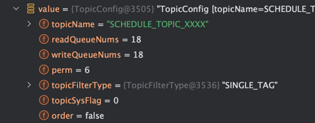
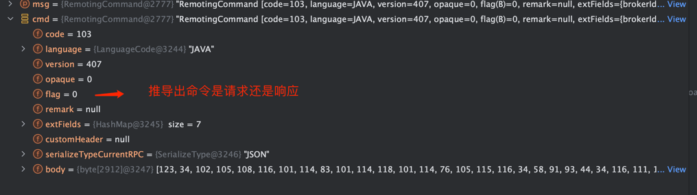

## Broker 

TopicConfig 内容

RemotingCommand 内容

RegisterBrokerBody --> byte[] --> crc32 --> 根据 byte[] 生成校验码, 确定内容的准确性
--> 设置为 RegisterBrokerRequestHeader 的 bodyData
--> 对应业务的 RequestCode + RegisterBrokerRequestHeader  组成 RemotingCommand
--> RemotingCommand 设置 body 为 RegisterBrokerBody 转换后的 byte[]

业务处理类
NettyRemotingServer 注册的 Handler 中 (NettyServerHandler.channelRead0)

30s 上报一次 Broker 的信息

ChannelFutureListener  --> 成功失败
NettyClientHandler

过程地址
https://www.processon.com/diagraming/65a9d52f7480e7592bf16270

https://www.processon.com/diagraming/65ae4a460357ee73140c4e76

